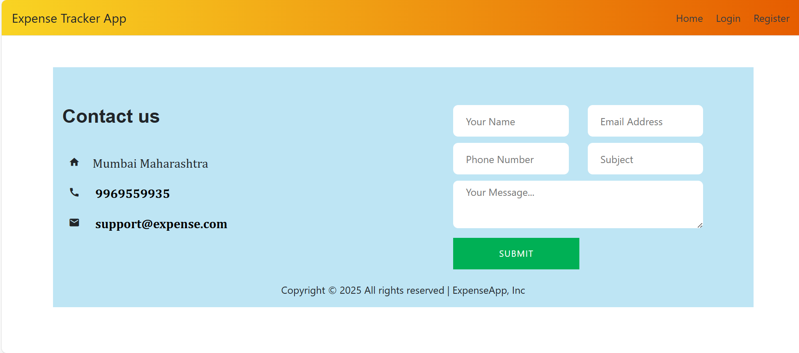

# Expense Tracker using Flask

## Overview
Expense Tracker is a powerful web-based application built on Flask, designed to help users efficiently manage their financial transactions, including earnings, expenses, savings, and investments. This tool enables users to log, track, and categorize their expenses, offering valuable insights into their spending patterns.

Additionally, the application comes with advanced data analysis and visualization features, allowing users to better understand their financial habits and make informed decisions. Whether you're a professional managing a budget or an individual keeping track of personal finances, Expense Tracker is the ideal solution for staying on top of your financial goals.

## Prerequisites
To use Expense Tracker effectively, ensure you have the following installed on your system:

1. Python 3.6 or higher
2. Flask web framework
3. Plotly for data visualization
4. Pandas for data manipulation
5. Basic knowledge of HTML, CSS, and JavaScript for customizing the front-end interface

With these dependencies installed, users can fully utilize the application's tracking, analysis, and visualization features, as well as customize the UI as needed.

## Project File Structure
```
C:.
|-- .gitignore
|-- expense.db
|-- main
|   |-- main.py
|-- README.md
|-- requirements.txt
|-- support
|   |-- support.py
|
|-- static
|   |-- css
|   |   |-- style.css
|   |
|   |-- js
|   |   |-- script.js
|
|-- templates
|   |-- analysis.html
|   |-- contact.html
|   |-- home.html
|   |-- login.html
|   |-- profile.html
|   |-- register.html
```

## Installation
1. Clone the repository: `git clone `
2. Install dependencies: `pip install -r requirements.txt`
3. Run the application: `python main.py`

## Features
- Secure user authentication with login and registration functionalities.
- An intuitive home page displaying financial records, statistics, and data visualizations.
- A dedicated analysis page offering in-depth insights into spending patterns through interactive charts.
- A user-friendly profile section for managing personal information such as name, email, and password.
- A contact page allowing users to submit feedback or inquiries.
- Advanced session management, automatically logging out inactive users after five minutes to ensure security.

Users will receive a warning before session expiration to save any unsaved data. For queries or feedback, contact details are available on the contact page.

## Usage
### 1. Login Page
- Users can log in with valid credentials.
- Upon successful login, they are redirected to the home page.
- Unauthorized users cannot access the home page.
- An error message appears for incorrect credentials.
- Password reset is available via the "Forgot Password" link.
- Users can navigate to the registration and contact pages.


### 2. Forgot Password
- Allows users to reset their password by entering their registered email and a new password.
- If the email exists in the system, the password is reset, and users can log in with the new credentials.
- If the email is not found, an alert notifies the user.


### 3. Registration Page
- Users can register by providing a name, email, and password.
- If the email is unique, the user is registered and redirected to the home page.
- If the email already exists, an alert informs the user.
- Users can navigate to the login and contact pages.


### 4. Home Page
- Displays financial records, graphs, and insights into spending habits.
- Users can add, edit, and delete records for income, expenses, savings, and investments.
- Interactive charts provide a clear understanding of financial trends.
- Users can set budgets and track financial goals.


### 5. Analysis Page
- Offers detailed insights into spending habits with interactive charts.
- Users can analyze expenses by category, month, and year.
- Graphs include pie charts, bar graphs, and line graphs.
- Users can compare expenses with earnings and savings.
- Graphs can be downloaded in image format for reference.


### 6. Profile Page
- Allows users to update personal details such as name, email, and password.
- Email updates must be unique and not already in use.
- Only logged-in users can access their profile settings.


### 7. Contact Page
- Users can submit feedback or queries through a form.
- Contact details (phone, email, address) are provided for additional support.
- Users can navigate back to the home or login page after submitting a query.



## Session Management
- User sessions expire after 5 minutes of inactivity to enhance security.
- Users receive a warning before session termination.
- The session timeout can be adjusted if required.

## Contributing
We welcome contributions to Expense Tracker! If you're interested in contributing, feel free to fork the repository and submit a pull request.

## Conclusion
Expense Tracker is a robust and user-friendly application designed to help users efficiently manage their finances. With features like secure authentication, expense tracking, financial analysis, and advanced data visualization, it provides users with the tools they need to take control of their financial future. By leveraging the insights gained from this application, users can make better financial decisions and achieve their financial goals.